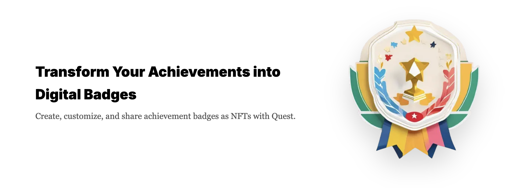
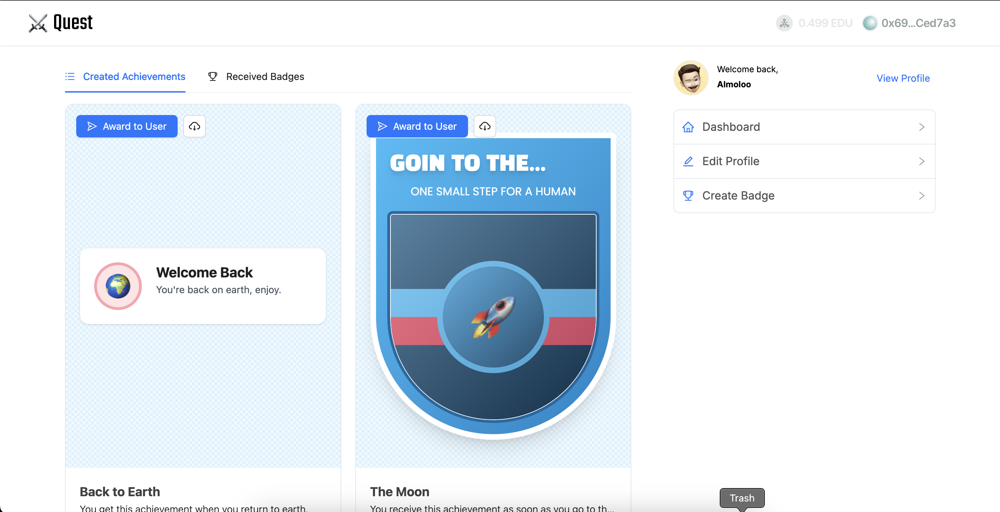

# 🏆 Quest - Achievement Dashboard

Welcome to **Quest**! This project is designed to help you manage and display achievements using blockchain technology on the **Open Campus** network. 🚀



## 📋 Table of Contents

-   [Features](#-features)
-   [Technologies Used](#-technologies-used)
-   [Installation](#-installation)
-   [Usage](#-usage)
-   [Customization](#-customization)
-   [Contributing](#-contributing)
-   [License](#-license)

## ✨ Features

-   🎨 **Customizable Achievements**: Create and manage achievements with custom designs.
-   🔗 **Blockchain Integration**: Leverage the Open Campus network to store and verify achievements.
-   📊 **Real-time Data**: Fetch and display real-time data from the blockchain.
-   🛠️ **Easy to Use**: Simple and intuitive interface for managing achievements.
-   🔍 **Search and Filter**: Easily search and filter through your achievements.
-   📈 **Analytics**: Gain insights with built-in analytics for your achievements.

## 🛠 Technologies Used

Quest is built using the following technologies:

-   **Next.js**: A React framework for server-side rendering and static site generation.
-   **wagmi**: A JavaScript library for interacting with the Ethereum blockchain.
-   **Tailwind CSS**: A utility-first CSS framework for styling the application.
-   **Pinata API**: A service for managing and pinning files to IPFS.
-   **Web3Modal**: A library for connecting to web3 wallets.
-   **Ant Design (AntD)**: A UI library for building user interfaces.

## 🛠 Installation

To get started with Quest, follow these steps:

1. **Clone the repository**:

    ```bash
    git clone https://github.com/almoloo/quest.git
    cd quest
    ```

2. **Install dependencies**:

    ```bash
    npm install
    ```

3. **Set up environment variables**:
   Create a `.env` file in the root directory and add your environment variables:

    ```env
    NEXT_PUBLIC_WC_PROJECT_ID=your_walletconnect_project_id
    NEXT_PUBLIC_CONTRACT_ADDRESS=your_contract_address
    PINATA_API_KEY=...
    PINATA_SECRET_API_KEY=...
    PINATA_JWT=...
    NEXT_PUBLIC_PINATA_GATEWAY=...
    NEXT_PUBLIC_PINATA_GATEWAY_TOKEN=...
    ```

4. **Run the development server**:
    ```bash
    npm run dev
    ```

## 🚀 Usage

Once the development server is running, you can access Quest at `http://localhost:3000`.

### Creating Achievements

1. **Select a Template**: Choose from a variety of predefined templates.
2. **Customize**: Add your own emoji, text, and colors.
3. **Save**: Save your customized achievement to the Open Campus network.


### Viewing Achievements

View all your achievements in a beautiful dashboard. Each achievement is verified and stored on the Open Campus network.



## 🎨 Customization

Quest allows you to fully customize your achievements. Here are some of the customization options available:

-   **Emoji/Icon**: Choose from a wide range of emojis and icons.
-   **Text**: Add custom text to your achievements.
-   **Colors**: Customize the background and text colors.
-   **Templates**: Select from multiple templates to give your achievements a unique look.

## 🤝 Contributing

We welcome contributions to Quest! To contribute, follow these steps:

1. **Fork the repository**.
2. **Create a new branch**:
    ```bash
    git checkout -b feature/your-feature-name
    ```
3. **Make your changes**.
4. **Commit your changes**:
    ```bash
    git commit -m "Add your commit message"
    ```
5. **Push to the branch**:
    ```bash
    git push origin feature/your-feature-name
    ```
6. **Create a pull request**.

## 📄 License

This project is licensed under the MIT License. See the [LICENSE](LICENSE) file for details.

---

Made with ❤️ by [Ali](https://github.com/almoloo) & [Hossein](https://github.com/hossein-79)
